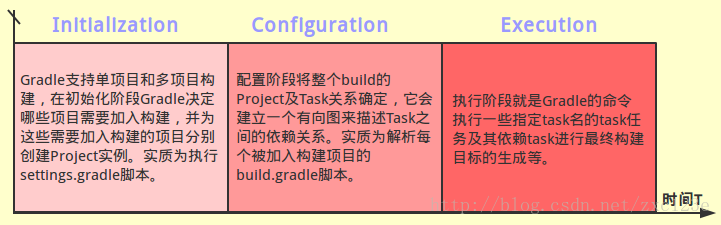
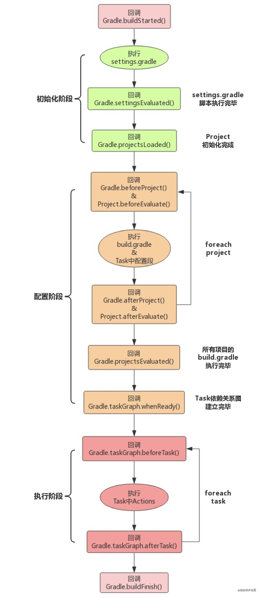

## Docs

- https://docs.gradle.org/current/userguide/build_lifecycle.html#header
- https://docs.gradle.org/current/dsl/org.gradle.api.Project.html#N14B96
- Project Object properties
  - https://docs.gradle.org/current/dsl/org.gradle.api.Project.html#N14CEA

## Objects

- https://docs.gradle.org/current/dsl/index.html

- 这里可以看到, 不同文件由不同对象处理
  - Settings script -> delegate to instance of Settings // 会被`Project`使用
    - `setttings`
  - Init script	-> delegate to instance of Gradle
    - `gradle.allprojects`
  - Build script -> delegate to instance of Project
    - `project`
    - `gradle`, `project.gradle`
    - Build script structure
      - allprojects { }
      - configurations { }
      - buildscript { }
      - configurations { }
      - dependencies { }
      - repositories { }
      - sourceSets { }
      - subprojects { }
      - publishing { }
    - With m Task

## Lifecycle

Gradle构建系统有自己的生命周期: 初始化, 配置, 运行三个阶段.

1. 初始化阶段: setting.gradle -> include 子工程
2. 配置阶段: 每个project中的build.gradle脚本, 由多个任务组成. 配置阶段完成后, 整个build的project以及内部的Task关系就确定了
3. 运行阶段: 执行Task





## Lab

```bash
gradle wrapper

./gradlew
# ./gradlew --init-script src/main/groovy/gradle/initd/init-script.gradle # this calls help by default

./gradlew --init-script src/main/groovy/gradle/initd/init-script.gradle hello
./gradlew --init-script src/main/groovy/gradle/initd/init-script.gradle hello > BUILD_LOG
```

思考


